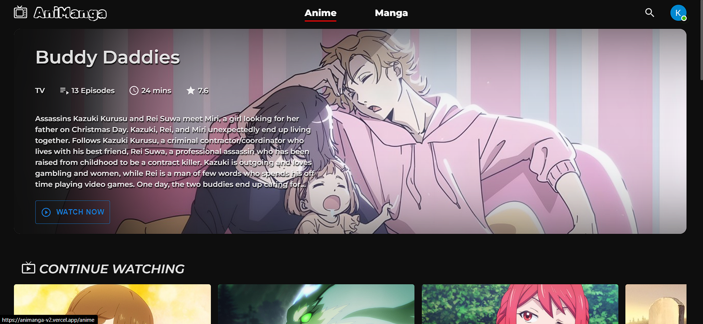
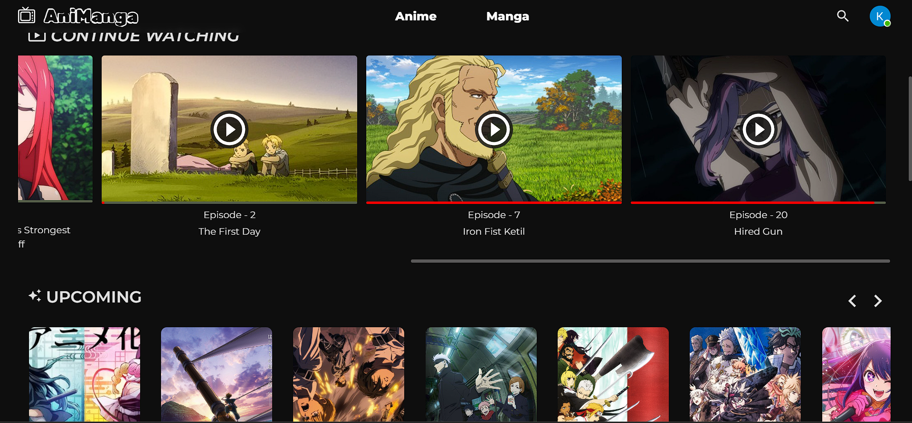
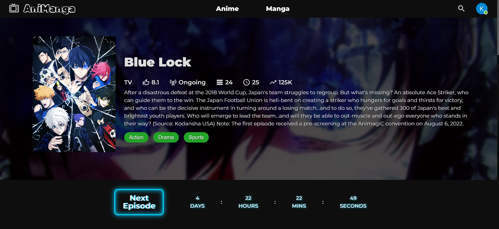
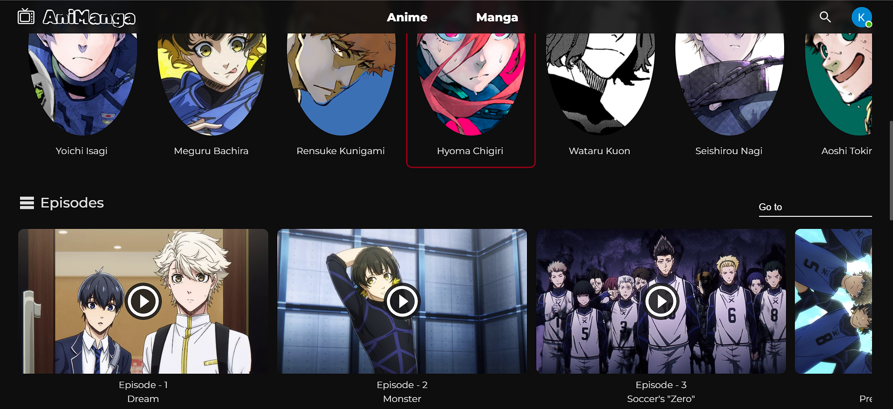
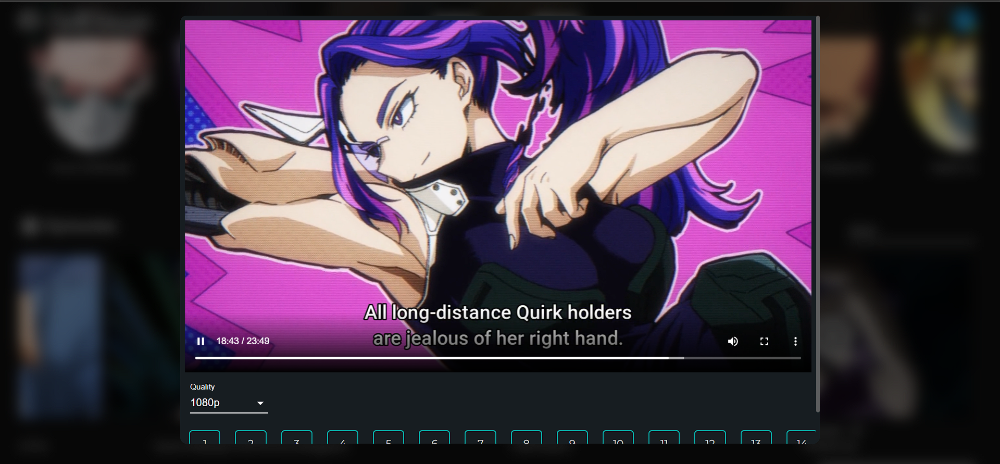
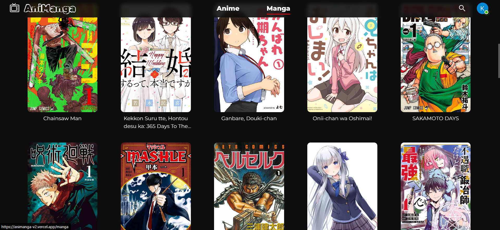
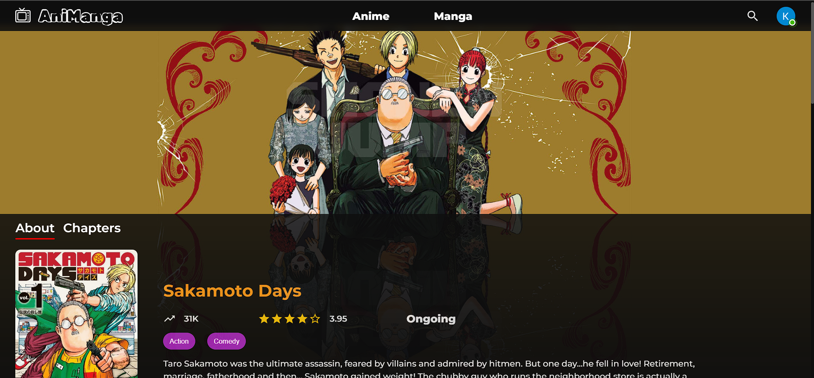
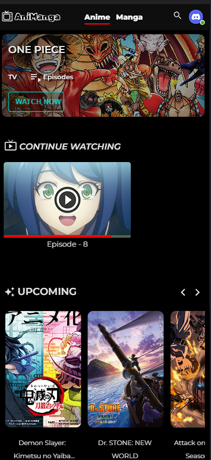
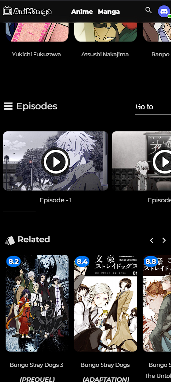

<h1 align="center">AniManga &nbsp;&nbsp; | &nbsp;&nbsp; アニマンガ<h1/>
<p align="center"> 
  <h3 align="center"> AniManga is an Ad free, responsive web application where you can stream Anime and read Manga.</h3>
<p/>

<br />
<p align="center">
  <a href="https://beta.reactjs.org/">
    
  </a>
  <a href="https://redux-toolkit.js.org/">
    
  </a>
  <a href="https://mui.com/">
    
  </a>
  <a href="https://supabase.com/">
    
  </a>
</p>

# Screenshots

## Desktop

<br/>


<br/>


<br/>


<br/>


<br/>


<br/>


<br/>


<br/>


<br/>

## Mobile

<br/>

<table>
<tr>
  <td>



  </td>
  <td>



  </td>
</tr>
</table>

<br />

# Deploying your own instance??

1. Star this repo (Very important step, believe me).
2. Deploy this project using deploy button - <br/> <br/>
   [](https://vercel.com/new/clone?repository-url=https://github.com/KunwarVSuryavanshi/animanga-v2)

3. So your frontend is deployed, now for the API - <br/> <br/>
   [](https://vercel.com/new/clone?repository-url=https%3A%2F%2Fgithub.com%2Fconsumet%2Fapi.consumet.org)

4. For DB, create an account on [supabase](https://supabase.com/), and then create a table for watchList using PostgreSQL or the UI.

5. Do check `.env.example`, where you can either paste those variable or directly use them in you file

<br/>

# Credit

`Anilist` & `Consumet` - For making this project possible. (Do check their repo and give it a star. &#128521;)

## Disclaimer :- 

```I am not promoting any illegal activity here. This is purely for educational purpose and I am not responsible if you use it for illegal purpose.```
