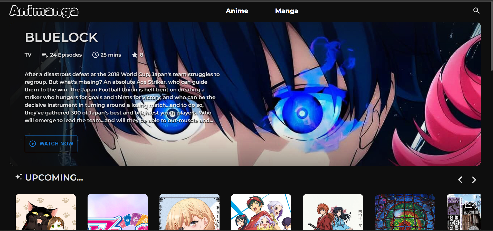
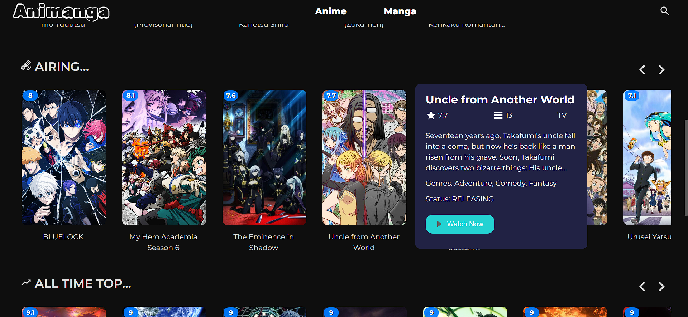
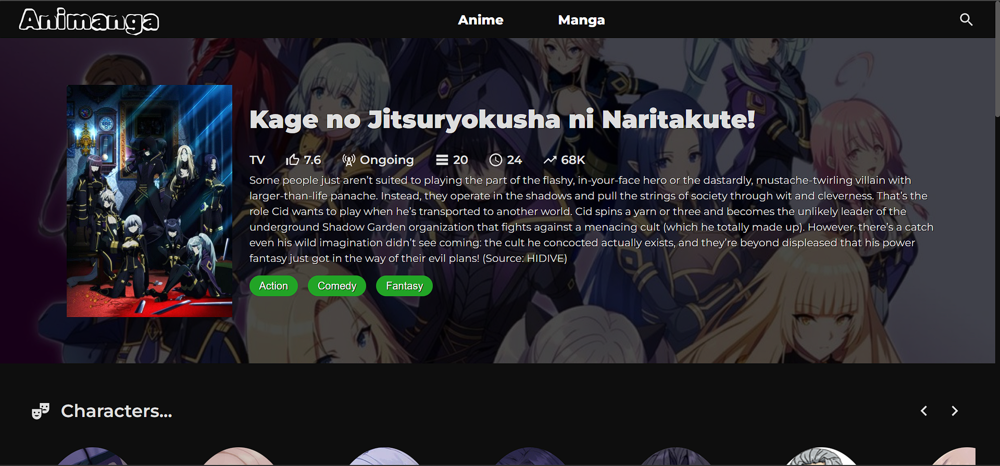
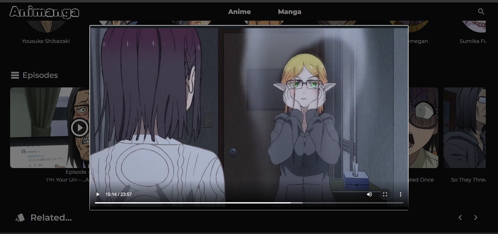
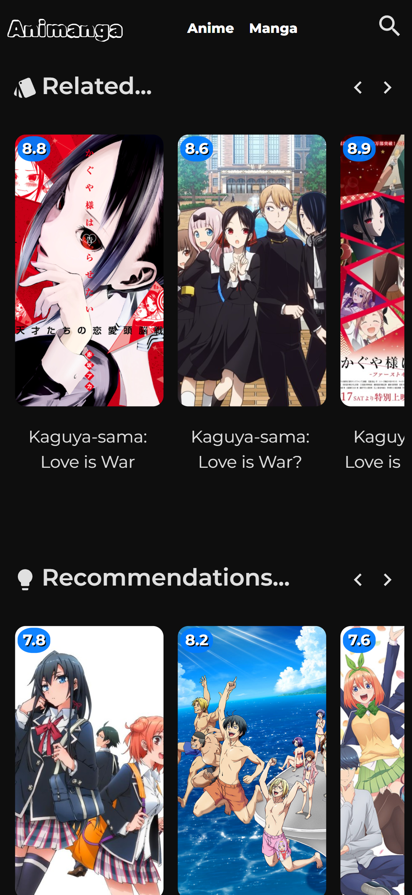

<h1 align="center">Animanga<h1/>

 
  <h3 align="center"> Animanga is an Ad free responsive web application where you can stream Anime and read Manga.</h3>

 

# Screenshots

## Desktop

 

 

 

 

 

## Mobile

 

<table>
<tr>
  <td>

.png>)

  </td>
  <td>

  </td>
</tr>
</table>

 

# Credit

`Anilist` - For anime related information.

`Consumet` - For streaming link + Info. (Do check their repo and give it a star. &#128521;)
